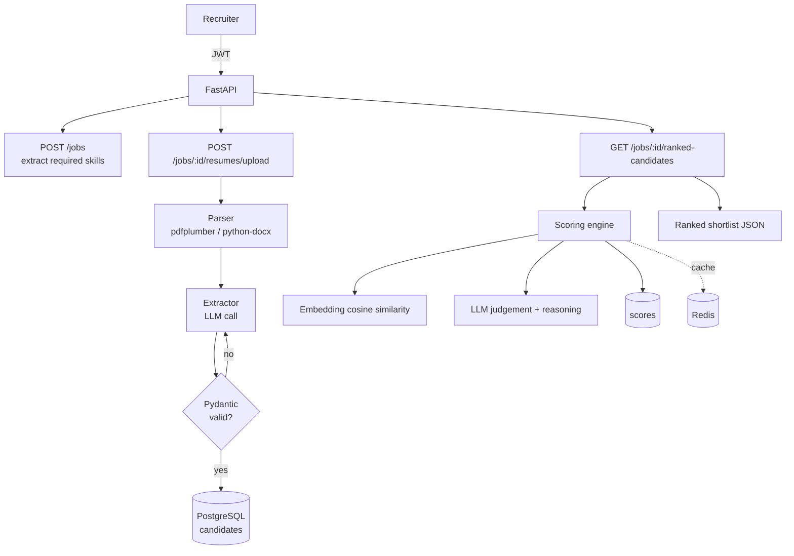

# Resume Screener

AI-powered resume parsing, structured extraction, scoring, and candidate ranking — as a production-shaped FastAPI backend.

Upload resumes (PDF/DOCX/TXT) against a job description; the service extracts structured candidate data with an **LLM + Pydantic validation (with retry)**, scores each candidate using **embedding similarity + LLM judgement**, and returns a **ranked shortlist** with reasoning.

> **Runs with zero setup.** The default configuration uses SQLite, an in-process cache, and a deterministic **offline mock LLM** — so you can clone and run the whole pipeline with no database, no Redis, and no API key. Switch to Postgres + Redis + a real LLM (Anthropic/OpenAI) purely through environment variables.

---

## Highlights

- **Structured extraction with self-correction** — the LLM is asked for JSON matching a strict `CandidateProfile` schema; the output is validated with Pydantic and, on failure, the validation error is fed back into the prompt and retried (the core, most interesting piece).
- **Hybrid scoring** — combines embedding cosine similarity with an LLM's holistic 0–100 fit judgement + a short reasoning string.
- **Pluggable LLM providers** — `mock` (offline), `anthropic`, `openai`, behind a one-method interface.
- **Auth + RBAC** — JWT login, `recruiter` vs `admin` roles.
- **Caching** — Redis when configured, in-memory fallback otherwise; scoring results are memoized.
- **Portable persistence** — the same SQLAlchemy models run on SQLite (dev/tests) and PostgreSQL (prod) via custom cross-dialect column types.
- **Batteries included** — Alembic migrations, Docker Compose, a test suite, sample data, and an end-to-end demo script.
- **Built-in web UI** — a single-page recruiter interface (served at `/`) for signing in, creating jobs, uploading resumes, and viewing the ranked shortlist. No separate frontend build.

---

## Architecture



**Request flow for the ranked shortlist:** parse → extract (validate + retry) → store → embed + LLM-score → weighted combine → cache → sort.

---

## Tech stack

| Layer | Technology |
| --- | --- |
| API | FastAPI + Uvicorn |
| Persistence | SQLAlchemy 2.0 (SQLite dev / PostgreSQL prod), Alembic |
| Validation / settings | Pydantic v2, pydantic-settings |
| Auth | JWT (PyJWT) + bcrypt (passlib), RBAC |
| Cache | Redis (in-memory fallback) |
| Resume parsing | pdfplumber, python-docx |
| Extraction / scoring | LLM (Anthropic / OpenAI / mock) + local embeddings |
| Packaging | Docker + docker-compose |

---

## Quickstart

### 0. Fastest path — the offline demo (no setup)

```bash
pip install -r requirements.txt
python scripts/generate_sample_data.py   # creates sample resumes + a job description
python scripts/demo.py                    # runs the whole flow in-process, prints a ranking
```

Example output:

```
[2/4] Created job 2114...
      Extracted required skills: Python, SQL, PostgreSQL, Redis, FastAPI, ...
[3/4] Uploaded 3 resumes -> extracted 3 profiles
      - Jane Doe        8.0 yrs  skills: Python, PostgreSQL, Redis, FastAPI, Docker, Kubernetes
      - Arjun Mehta     4.0 yrs  skills: Python, PostgreSQL, Django, Docker, AWS, Pandas
      - Maria Santos    3.0 yrs  skills: JavaScript, TypeScript, MySQL, React, Vue, Node.js
[4/4] Ranked shortlist:
      #  Name              Final    Sim    LLM  Reasoning
      1  Jane Doe           74.3   58.6   84.7  Matches 13/17 required skills ...
      2  Arjun Mehta        52.0   37.2   61.8  Matches 7/17 required skills ...
      3  Maria Santos       30.6   18.4   38.8  Matches 1/17 required skills (Git).
```

### 1. Run the API + web UI

```bash
cp .env.example .env          # optional; defaults already work
uvicorn app.main:app --reload
```

Open **http://localhost:8000/** for the built-in recruiter web UI — sign in, create a job, upload resumes, and see the ranked shortlist with fit scores and reasoning. The interactive API docs are at **http://localhost:8000/docs** (use **Authorize** after registering).

### 2. Run with Docker (Postgres + Redis)

```bash
docker compose up --build
```

This starts Postgres, Redis, and the API (running Alembic migrations first). It defaults to the mock LLM; to use a real model, set `LLM_PROVIDER` and the corresponding API key (see below).

### 3. Use a real LLM

```bash
export LLM_PROVIDER=anthropic
export ANTHROPIC_API_KEY=sk-ant-...
export ANTHROPIC_MODEL=claude-sonnet-5     # or another model you have access to
uvicorn app.main:app --reload
```

(Or `LLM_PROVIDER=openai` with `OPENAI_API_KEY`.) No code changes — the provider is selected from config.

---

## API

All routes are under `/v1`. Auth is via `Authorization: Bearer <token>`.

| Method | Endpoint | Purpose | Auth |
| --- | --- | --- | --- |
| POST | `/v1/auth/register` | Create a recruiter/admin account | — |
| POST | `/v1/auth/login` | Log in, returns a JWT (OAuth2 form) | — |
| GET | `/v1/auth/me` | Current user | JWT |
| POST | `/v1/jobs` | Create a job (auto-extracts required skills) | JWT |
| GET | `/v1/jobs` | List your jobs | JWT |
| GET | `/v1/jobs/{id}` | Job detail | JWT |
| POST | `/v1/jobs/{id}/resumes/upload` | Upload one or more resumes | JWT |
| GET | `/v1/jobs/{id}/candidates` | List extracted candidates | JWT |
| GET | `/v1/jobs/{id}/ranked-candidates` | Ranked shortlist with scores (`?rescore=true`) | JWT |
| GET | `/v1/candidates/{id}` | Candidate detail + score | JWT |
| DELETE | `/v1/candidates/{id}` | Delete a candidate | JWT (admin) |

### cURL walkthrough

```bash
# register + login
curl -s -X POST localhost:8000/v1/auth/register \
  -H 'Content-Type: application/json' \
  -d '{"email":"me@example.com","password":"password1"}'

TOKEN=$(curl -s -X POST localhost:8000/v1/auth/login \
  -d 'username=me@example.com&password=password1' | python -c 'import sys,json;print(json.load(sys.stdin)["access_token"])')

# create a job
JOB=$(curl -s -X POST localhost:8000/v1/jobs -H "Authorization: Bearer $TOKEN" \
  -H 'Content-Type: application/json' \
  -d '{"title":"Backend Engineer","description":"Python, FastAPI, PostgreSQL, Docker, AWS"}' \
  | python -c 'import sys,json;print(json.load(sys.stdin)["id"])')

# upload a resume
curl -s -X POST "localhost:8000/v1/jobs/$JOB/resumes/upload" \
  -H "Authorization: Bearer $TOKEN" -F "files=@sample_data/resume_jane.pdf"

# ranked shortlist
curl -s "localhost:8000/v1/jobs/$JOB/ranked-candidates" -H "Authorization: Bearer $TOKEN"
```

---

## Configuration

Everything is environment-driven (see `.env.example`). Key variables:

| Variable | Default | Notes |
| --- | --- | --- |
| `DATABASE_URL` | `sqlite:///./resume_screener.db` | Use `postgresql+psycopg2://...` in prod |
| `REDIS_URL` | *(unset)* | In-memory cache if unset |
| `JWT_SECRET` | `change-me-in-production` | **Set this in prod** |
| `LLM_PROVIDER` | `mock` | `mock` / `anthropic` / `openai` |
| `LLM_MAX_RETRIES` | `2` | Extraction validation retries |
| `ANTHROPIC_API_KEY` / `ANTHROPIC_MODEL` | — / `claude-sonnet-5` | For the Anthropic provider |
| `SIMILARITY_WEIGHT` / `LLM_WEIGHT` | `0.4` / `0.6` | `final = 0.4·sim·100 + 0.6·llm` |
| `AUTO_CREATE_TABLES` | `true` | Dev convenience; use Alembic in prod |

---

## How the core pieces work

### Structured extraction (the heart)

`app/services/extractor.py` implements:

```
LLM call → parse JSON → validate against CandidateProfile (Pydantic)
        → on failure: append the validation error to the prompt and retry (≤ LLM_MAX_RETRIES)
```

LLMs don't reliably return schema-perfect JSON on the first try, so this loop turns "hope the model behaves" into a robust contract. A tolerant JSON recovery step also strips code fences and surrounding prose.

### Scoring engine

`app/services/scorer.py` combines two signals:

- **Similarity** — cosine similarity between embeddings of the JD and the resume text (`app/services/embeddings.py`). The default is a dependency-free, deterministic hashing embedding; swapping in a real embedding model / pgvector is a drop-in change.
- **LLM judgement** — the model scores fit 0–100 and returns a one–two sentence justification.

`final = SIMILARITY_WEIGHT · (similarity·100) + LLM_WEIGHT · llm_score`, memoized per `(job, candidate)`.

---

## Testing

```bash
pytest        # 25 tests: auth, RBAC, jobs, upload+extraction, retry loop, scoring/ranking, PDF/DOCX parsing
```

Tests run fully offline (SQLite + mock LLM + in-memory cache) with a fresh database per test.

---

## Project structure

```
app/
  main.py                 FastAPI app + lifespan (serves the web UI at /)
  static/index.html       single-page recruiter web UI (no build step)
  core/                   config (pydantic-settings), security (JWT, bcrypt)
  db/                     Base, session, portable GUID/JSON column types
  models/                 SQLAlchemy models: user, job, candidate, score
  schemas/                Pydantic schemas incl. CandidateProfile (LLM target)
  api/                    routers: auth, jobs, resumes, candidates + deps
  services/
    parser.py             PDF/DOCX/TXT text extraction
    extractor.py          LLM extraction + Pydantic validation + retry
    scorer.py             similarity + LLM judgement -> final score
    embeddings.py         local deterministic embeddings + cosine
    cache.py              Redis / in-memory cache
    llm/                  provider interface + mock / anthropic / openai + prompts
alembic/                  migrations
tests/                    pytest suite
scripts/                  generate_sample_data.py, demo.py
```

---

## Design decisions

- **Offline-first, config-swappable.** Mock LLM + SQLite + in-memory cache by default so the project is trivially runnable and testable; production dependencies are opt-in via env. The same code path serves both.
- **Thin provider interface.** Providers expose only `complete(system, user)`; all structured behaviour (parsing, validation, retries) lives in the callers, so adding a provider is trivial and the interesting logic is provider-agnostic.
- **Portable column types.** A custom `GUID` and a `JSONB`/`JSON` variant let identical models run on SQLite and Postgres without conditionals.
- **Persist + cache scores.** The `scores` table is the source of truth; Redis avoids recompute (and re-hitting the LLM) on repeated dashboard loads.

---

## Handling PII

Resumes contain personal data (emails, phone numbers). This project keeps raw text for re-processing but is structured so PII handling is explicit: logs avoid dumping candidate contents, files are stored per-job, and `DELETE /candidates/{id}` cascades to scores. In a real deployment you'd add encryption at rest, retention policies, access logging, and redaction in logs/telemetry.

---

## Roadmap / next steps

- **React dashboard** — the current UI is a dependency-free single-page app served by FastAPI; a React + Vite + Tailwind version is a natural upgrade for a richer build.
- **Async batch processing** of hundreds of resumes with Celery/RQ + a task queue.
- **pgvector** for persistent, indexed semantic search instead of in-memory cosine.
- **Native structured outputs** where the provider supports schema-guaranteed JSON (keeping the validation+retry loop as a safety net).

---

## Interview talking points

- Why Pydantic validation **+ retry** matters (LLMs don't always return valid structured output first try).
- Handling **PII** responsibly in storage and logs.
- Why **hybrid** scoring (embedding similarity *and* LLM judgement) beats either alone.
- How this scales to **async batch** processing (Celery/RQ) and **pgvector** for semantic search.
